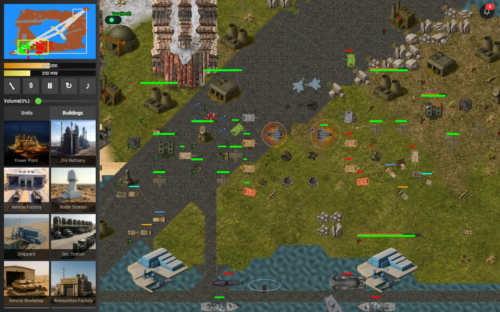
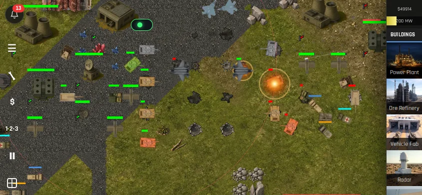
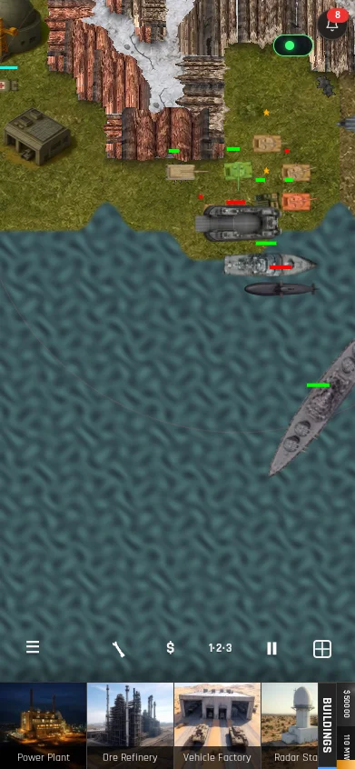

# Code for Battle

Code for Battle is a 2D, tile-based RTS game built with vanilla JavaScript and Canvas with WebGL (WebGPU also coming soon!).

## 🎯 Purpose

This project started in December 2024 as an experiment and benchmark: can frontier LLMs 0-shot a complex RTS game from prompt-driven development.

Over time, that benchmark evolved into a full RTS game. The long-term vision is to support LLM-controlled AI players and provide a built-in, user-friendly programming workflow so players can automate unit behavior and strategy (TBD).

The project is fully vibe coded.

## 🖼️ Screenshots

<p align="center">
	
</p>

<table>
	<tr>
		<td width="60%" valign="top">
			<strong>Mobile (Landscape)</strong><br />
			
		</td>
		<td width="40%" valign="top">
			<strong>Mobile (Portrait)</strong><br />
			
		</td>
	</tr>
</table>

## 🚀 Install and Run Locally

### ✅ Prerequisites

- Node.js 20+
- npm 10+

### 📦 Setup

```bash
npm install
```

### 🕹️ Start the game (local development)

```bash
npm run dev
```

The app will be available at the local URL shown by Vite in your terminal.

### 🌐 Optional multiplayer signalling helper

For invite-based WebRTC multiplayer testing, run the signalling helper in a second terminal:

```bash
npm run stun
```

Cross-device joins (iPhone, iPad, or a client on another network) need a TURN relay in addition to STUN. Same-computer browsers can connect with host candidates alone. Phones cannot open an invite whose host is `localhost`, and iOS Safari will not start WebRTC on a plain `http://` page. Create the invite on the public HTTPS site.

Set these variables for Netlify Functions (production, deploy previews, and branch deploys) or in the environment of `npm run stun`. In the Netlify UI: Site configuration → Environment variables → add the key for Functions. Do not put TURN passwords in `VITE_*` variables for a production build; those are embedded in the client bundle and are only a fallback when `GET /api/signalling/ice-servers` fails.

- `ICE_SERVERS` — JSON array of RTCIceServer objects, or `{ "iceServers": [ ... ] }`. Use this when a provider dashboard gives you the whole list. Public STUN is always added as well.
- `TURN_URLS` — comma-separated `turn:` and `turns:` URLs. Include TCP and `turns:` on port 443 so iOS Safari and cellular networks can connect.
- `TURN_SECRET` — coturn `static-auth-secret` / `use-auth-secret`. The signalling API mints a 12-hour username (`<expiry>:cfb`) and HMAC-SHA1 credential and does not log the secret.
- Or, instead of `TURN_SECRET`, set `TURN_USERNAME` and `TURN_CREDENTIAL` for a provider that issues a username and password.
- Optional build-time fallback, only if the ice-servers request fails: `VITE_ICE_SERVERS` (same JSON as `ICE_SERVERS`), or `VITE_TURN_URLS` plus `VITE_TURN_USERNAME` and `VITE_TURN_CREDENTIAL`.

The browser asks `GET /api/signalling/ice-servers` when a peer connection starts. Function logs record candidate type (`host`, `srflx`, `relay`, mDNS) without player names, IP addresses, usernames, or credentials. A join that only gathered mDNS host candidates and `relay: 0` cannot reach another device until TURN is configured. The phone's join screen shows the ICE state (`ICE checking`, `ICE failed`) and the failure reason.

### TURN providers

Paste credentials from the provider dashboard. This repo does not ship a live relay password.

**Metered.ca (free Open Relay or metered TURN).** Sign up at [Metered TURN](https://www.metered.ca/tools/openrelay/), create a credential, and copy the `iceServers` JSON into `ICE_SERVERS`. Prefer the `turns:` URL on port 443. Open Relay credentials from their REST API expire; when they do, paste a fresh JSON value (or use `TURN_URLS` / `TURN_USERNAME` / `TURN_CREDENTIAL` if the dashboard shows a longer-lived username and password). Example shape, with placeholder values:

```json
[
  {
    "urls": [
      "turn:global.relay.metered.ca:80",
      "turn:global.relay.metered.ca:443",
      "turns:global.relay.metered.ca:443?transport=tcp"
    ],
    "username": "<from the Metered dashboard>",
    "credential": "<from the Metered dashboard>"
  }
]
```

**Twilio Network Traversal.** Create a token with the [Network Traversal Service](https://www.twilio.com/docs/stun-turn). The response `ice_servers` entries expire (often within a day). Map `url`/`urls`, `username`, and `credential` into `ICE_SERVERS`. Do not put the Twilio auth token in the client.

**Cloudflare Realtime TURN.** Generate short-lived TURN credentials from the Cloudflare dashboard or API and paste the resulting `turn`/`turns` URLs plus username and credential into `ICE_SERVERS` or `TURN_URLS` + `TURN_USERNAME` + `TURN_CREDENTIAL`. Refresh them before they expire. Include a `turns:` URL on port 443 for iOS.

**Self-hosted coturn.** Set `TURN_URLS` and `TURN_SECRET` to the server's `static-auth-secret`. The function mints the username and HMAC itself, so you do not rotate a password by hand.

### 🧪 Optional Netlify local multiplayer test

If Netlify CLI is installed globally, you can run a local Netlify environment for multiplayer/signalling endpoints:

```bash
netlify dev
```

## Landing page

The marketing page is served on the same site:

- `/en/landing`
- `/de/landing`
- `/landing` (browser language, or the last locale opened)

The in-game sidebar links to it under the legal links. See [specs/090-marketing-landing-page.md](./specs/090-marketing-landing-page.md).

## 📘 How to Play

User documentation and gameplay reference:

- [In-game and gameplay documentation](./Documentation.md)
- [Spec 032: In-Game User Documentation](./specs/032-user-documentation.md)

## 🏗️ Architecture Documentation

Technical and architecture-focused documentation:

- [Architecture diagram and technical notes](./AI_Docs/ARCHITECTURE_DIAGRAM.md)
- [Multiplayer architecture spec](./specs/001-add-online-multiplayer/)
- [State sync architecture notes](./specs/state-sync-module.md)

## 🗂️ Legacy README

The previous README has been preserved at:

- [README.legacy.md](./README.legacy.md)

## 📄 License

This project is licensed under the MIT License. See [LICENSE](./LICENSE).
