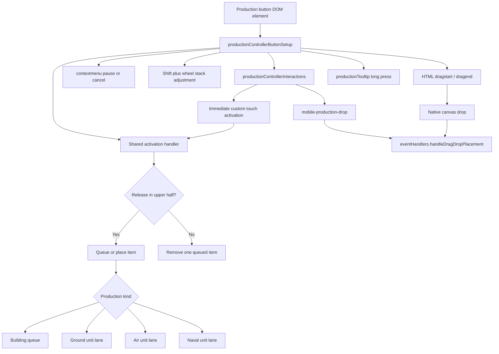
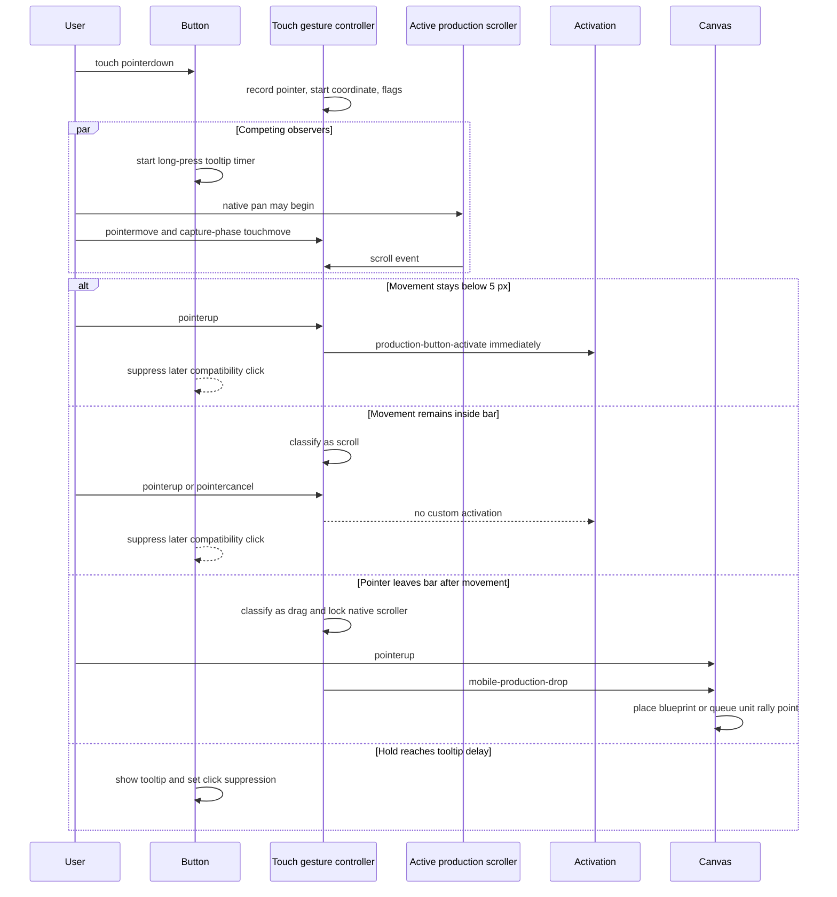

# Production Button Input Architecture

This document describes the production-button behavior and event flow shared by building buttons and ground, air, and naval unit buttons. It is intended as the source-of-truth overview to read before changing production input handling.

## Source map

| Responsibility | Source |
| --- | --- |
| Controller state and delegation | `src/ui/productionController.js` |
| Button creation-time listeners and build/cancel behavior | `src/ui/productionControllerButtonSetup.js` |
| Touch gesture classification, drag-to-map, stack direction indicator | `src/ui/productionControllerInteractions.js` |
| Long-press tooltip gesture | `src/ui/productionTooltip.js` |
| Unit/building tabs and mobile category toggle | `src/ui/productionControllerTabs.js` |
| Moving the same production DOM between desktop and mobile containers | `src/ui/mobileLayout.js` |
| Desktop HTML drop and mobile custom drop consumption | `src/ui/eventHandlers.js` |
| Button and scroller touch/overflow rules | `styles/base.css`, `styles/sidebar.css` |
| Production lanes and stack counters | `src/productionQueue.js`, `src/ui/productionControllerQueue.js` |

## Shared architecture

The game does not clone production buttons for mobile. `mobileLayout.js` reparents the existing `#productionArea`, so the same button elements and listeners survive layout changes.



### Shared activation rules

- Both native `click` and custom `production-button-activate` call the same activation handler.
- The release `clientY` is compared with the button midpoint.
- Upper half increases the stack. Lower half decreases it.
- A building with no existing stack always treats its first activation as an increase, regardless of half.
- A ready-for-placement building uses a single activation to enter placement mode and a second activation within the double-click window to stack another building.
- Unit removal resolves the ground, air, or naval lane that owns the unit type.
- Disabled or paused-game buttons do not start new production.
- Map-edit mode turns activation into a unit or building brush action.
- A short-lived arrow overlay shows increase or decrease direction.

## Desktop behavior

```mermaid
sequenceDiagram
  participant User
  participant Button
  participant Activation
  participant Queue
  participant Canvas

  alt Left click
    User->>Button: pointer press and release
    Button->>Activation: native click
    Activation->>Queue: add or remove by button half
  else Drag to map
    User->>Button: native dragstart
    Button->>Button: set dragged building or unit state
    User->>Canvas: drop
    Canvas->>Queue: building blueprint or unit with rally point
    Button->>Button: dragend cleanup
  else Right click
    User->>Button: contextmenu
    Button->>Queue: pause current item, cancel paused item, or remove latest stacked item
  else Shift plus wheel
    User->>Button: wheel
    Button->>Queue: wheel up adds; wheel down removes
  else Long hold
    User->>Button: primary pointer held
    Button->>Button: open production tooltip
  end
```

Desktop mouse pointers intentionally bypass the touch gesture state machine. This preserves native clicks and native HTML drag/drop for both buildings and units.

## Mobile layouts and native scrollers

| Layout | Production DOM parent | Actual production scroller | Scroll axis |
| --- | --- | --- | --- |
| Desktop and expanded portrait sidebar | `#sidebarScroll` contains `#productionArea` | `#sidebarScroll` | Vertical |
| Mobile landscape | `#mobileBuildMenuContainer` contains `#productionArea` | `#production` | Vertical |
| Mobile portrait, condensed bottom bar | `#mobileBuildMenuContainer` contains `#productionArea` | `#production` | Horizontal |

The default production button uses `touch-action: manipulation`. The desktop sidebar explicitly uses `touch-action: pan-y`. Mobile overrides both the actual `#production` scroller and its buttons with the intended axis: `pan-y` in landscape and `pan-x` in portrait-condensed. The portrait scroller also uses `-webkit-overflow-scrolling: touch`.

## Mobile tap, scroll, and drag flow



### Mobile-specific state

| State | Owner | Meaning |
| --- | --- | --- |
| `controller.mobileDragState` | Gesture controller | The current touch pointer, starting coordinates, mode, button, and drag locks |
| `state.mode` | Per gesture | `null`, `scroll`, or `drag` |
| `state.moved` | Per gesture | Movement reached the production tap threshold |
| `state.scrolled` | Per gesture | The observed interaction element emitted `scroll` |
| `controller.productionBarWasDragged` | Controller | Cross-listener release guard set by pointer movement, touch movement, scrolling, release displacement, or cancellation |
| `controller.suppressNextClick` | Controller | Shared suppression used by drag-to-map and the long-press tooltip |
| `button._suppressCompatibilityClick` | Button | Prevents the native compatibility click from duplicating or following a custom touch activation |
| `gameState.draggedBuildingType/Button` | Game state | Active building drag-to-map payload |
| `gameState.draggedUnitType/Button` | Game state | Active unit drag-to-rally payload |

## Other mobile gestures that overlap the production bar

`mobileLayout.js` also observes document-level touch events:

- In portrait-condensed mode, a vertical downward swipe beginning in `#mobileBuildMenuContainer` can collapse the bar.
- In landscape, a horizontal swipe near the left side can close or open the sidebar.
- These listeners may call `preventDefault()` after their own movement threshold, but they do not directly build units or buildings.
- The tooltip has its own pointer listeners and shares `controller.suppressNextClick` with production drag handling.

## Timings and gesture thresholds

### JavaScript timings

| Value | Current setting | Purpose |
| --- | ---: | --- |
| `LONG_PRESS_MS` | 250 ms | Opens the production tooltip and suppresses the associated click |
| Building `DOUBLE_CLICK_THRESHOLD` | 500 ms | On a ready building, distinguishes placement from stacking another building |
| Stack direction indicator hide delay | 500 ms | Keeps the increase/decrease arrow visible after activation |
| Paused-build error-state lifetime | 300 ms | Removes the button's `.error` class after a rejected queue attempt |
| Temporary desktop drag image cleanup | 10 ms | Removes the transparent drag image after `dragstart` |
| Mobile edge-scroll nominal frame | 16 ms | Fallback delta used for drag-to-map edge scrolling |
| Mobile edge-scroll maximum frame delta | 64 ms | Caps a delayed edge-scroll step |
| Landscape tap classification window | 50 ms | Keeps synthetic activation lossless while allowing real iOS's asynchronous vertical scroller to veto a release after `pointerup`, including on 120 Hz displays |
| Tab image reload delay | 10 ms | Reassigns an image source when forcing a tab image reload |

### Movement and layout thresholds

| Value | Current setting | Purpose |
| --- | ---: | --- |
| Production tap movement threshold | 5 CSS px radial distance | At or above this distance, a touch must not activate production |
| Tooltip drag cancellation threshold | 8 CSS px per axis | Cancels the long-press timer |
| Mobile map edge-scroll zone | 20 CSS px | Starts camera edge scrolling during production drag-to-map |
| Mobile map edge-scroll speed | 0.14 CSS px/ms | Camera movement speed while dragging at a map edge |
| Sidebar swipe `preventDefault` threshold | 10 CSS px | Claims the relevant vertical or horizontal sidebar gesture |
| Sidebar swipe activation threshold | 40 CSS px | Collapses, expands, condenses, or hides the sidebar/bar |
| Sidebar edge-open zone | 28 CSS px | Allows an opening gesture from the screen edge |
| Landscape sidebar close zone | 140 CSS px | Allows a closing gesture from the left side |

### CSS animation timings affecting production UX

| Value | Current setting | Purpose |
| --- | ---: | --- |
| Stack arrow opacity transition | 80 ms | Fades the increase/decrease indicator |
| Production tooltip open/close transition | 150 ms | Fades and moves the long-press tooltip |
| Production tooltip link feedback transition | 150 ms | Animates tooltip link border/background feedback |
| Production progress width transition | 100 ms | Smooths progress-bar updates |
| Cost and power label opacity transition | 200 ms | Fades production metadata on hover |
| Tab color/background transition | 200 ms | Animates unit/building tab feedback |
| Production error background transition | 300 ms | Animates error-state feedback |
| Production error shake | 300 ms | Shakes a button after a rejected paused-game queue attempt |
| Ready-for-placement pulse | 1,200 ms repeating | Pulses a completed building awaiting placement |
| Mobile portrait sidebar transform | 250 ms | Animates sidebar collapse/condense transitions around the production UI |

## Real-iOS defect identified on 2026-08-23

Two conditions combined to create the physical-iPhone-only failure:

1. The gesture controller chose the mobile `#production` scroller only when `body.mobile-landscape` was present. In portrait-condensed mode, `mobileLayout.js` also reparents `#productionArea` into `#mobileBuildMenuContainer`, and CSS makes `#production` the horizontal scroller. Despite that, the controller watched and locked the now-unrelated desktop `#sidebarScroll`.
2. Buttons used `touch-action: manipulation`. [WebKit bug 240917](https://bugs.webkit.org/show_bug.cgi?id=240917) documents that real iOS WebKit can scroll such a container without dispatching the expected `pointercancel`; the report explicitly notes that Chrome does not reproduce it and that explicit pan-axis values do dispatch cancellation.

Consequences:

- A real iPhone can let WebKit consume/coalesce movement while scrolling `#production`.
- No `scroll` event is observed on the element the controller selected.
- The selected element's `scrollLeft` never changes.
- If WebKit also withholds usable intermediate movement from the Pointer Events path, release remains classified as a tap and the controller dispatches `production-button-activate`.
- Chrome desktop touch emulation still supplies movement events, which masks the wrong-scroller defect.

The correction resolves the interaction element from the touched button's actual DOM ancestry instead of orientation classes. It also declares `pan-x` for the portrait-condensed production scroller/buttons and `pan-y` for the landscape scroller/buttons. This preserves native scrolling along the bar while keeping the perpendicular direction available for drag-to-map. Regression coverage includes the portrait-condensed horizontal production bar as well as landscape.

Real-device follow-up showed that portrait was corrected while landscape could still receive its vertical `scrollTop` update or `scroll` event after `pointerup`. Landscape candidate taps therefore retain the custom activation path but wait 50 ms before dispatch. Any late scroll event or scroll-position change vetoes the build. Every stationary release retains its own pending activation, so rapid tapping remains lossless rather than relying on compatibility-click delivery.
