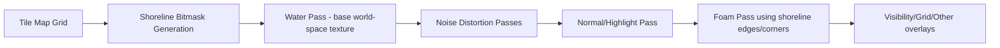
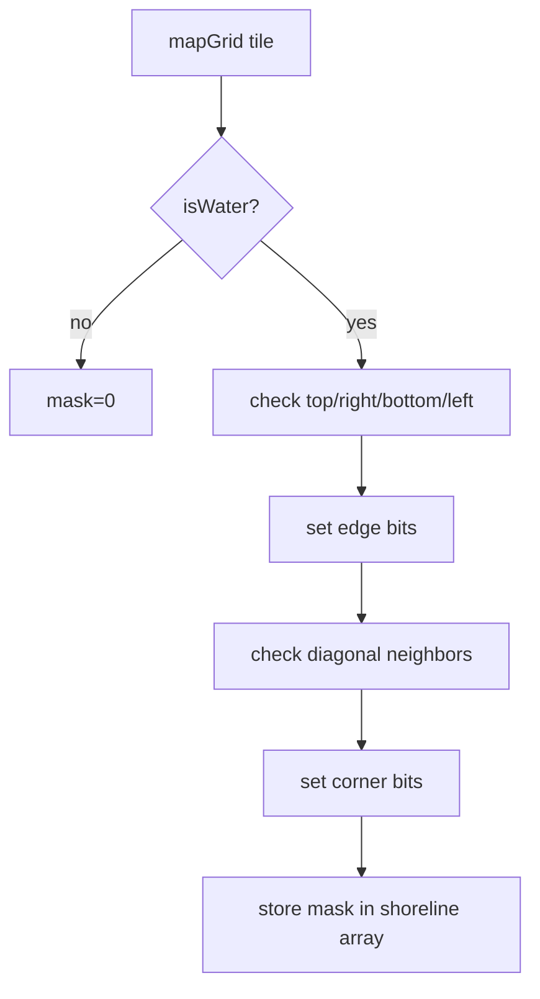
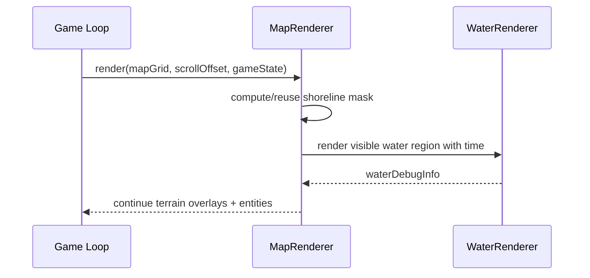

# Water Rendering Architecture

This document describes the seamless, world-space water system used by the terrain renderer.

## 1) Architecture overview

The map remains tile-based for logic/pathfinding, while water is rendered as a continuous surface in screen space from world coordinates.

- `MapRenderer` computes a deterministic shoreline bitmask from tile adjacency.
- `WaterRenderer` draws only water tiles, but samples repeating textures in **world space**.
- Two animation layers (broad + micro movement) are combined, plus optional noise and normal-map highlight passes.
- Foam is rendered only where shoreline bitmask flags indicate coast adjacency.

## 2) Rendering pipeline

The base UV anchoring uses world-aligned pattern transforms so animation does not restart per tile and does not “swim” when panning camera.

## 3) Asset usage

Assets expected in `public/images/map/water/`:

- `water_base_seamless_512.webp`
- `water_normal_seamless_512.png`
- `water_noise_seamless_512.webp`
- `shore_foam_texture_seamless_512.png`

These are loaded through `TextureManager.getOrLoadImage(...)` by `WaterRenderer`.

## 4) Shoreline detection logic

For each water tile:

- Check 4-neighborhood for edge flags (top/right/bottom/left)
- Check diagonals for corner flags
- Encode result in a compact `Uint8Array` mask per tile

Bitmask layout:

- `1`: top
- `2`: right
- `4`: bottom
- `8`: left
- `16`: top-left corner
- `32`: top-right corner
- `64`: bottom-right corner
- `128`: bottom-left corner

## 5) Performance considerations

- Water is rendered only over visible tile bounds.
- Shoreline mask is precomputed and reused.
- Typed arrays (`Uint8Array`) are used for compact shoreline storage.
- The pass remains deterministic and side-effect free relative to simulation state.
- Existing chunk cache for non-water base terrain remains active.

## 6) Fallback path behavior

The implementation currently uses a canvas 2D layered fallback aligned in world space:

- repeating base pattern layer A and B with different velocities
- dual noise modulation passes
- optional normal map highlight pass (blend mode based)
- foam strips/corners constrained by shoreline mask

This keeps the same high-level API so a future full shader material can replace internals without changing terrain/map logic.

## 7) Tuning parameters

`gameState.waterRenderConfig` supports:

- `waterTextureScale`
- `layerASpeed`, `layerBSpeed`
- `noiseScaleA`, `noiseScaleB`
- `noiseSpeedA`, `noiseSpeedB`
- `distortionStrength`
- `highlightStrength`
- `foamStrength`, `foamWidthPx`, `showFoam`
- `waterTintMultiplier`
- `depthDarknessMultiplier`
- `shorelineDebugOverlay`

## 8) Limitations and extension ideas

Current limitations:

- Canvas blend modes emulate distortion/highlights but are not physically-based lighting.
- Foam is edge-band based, not distance-field based.

Possible upgrades:

- move full water material to WebGL fragment shader using world UV uniforms
- signed-distance shoreline mask for smoother foam falloff
- light direction + specular controls from day/night cycle
- batched shoreline mesh strips for lower draw call pressure on huge maps

## Update/render lifecycle

