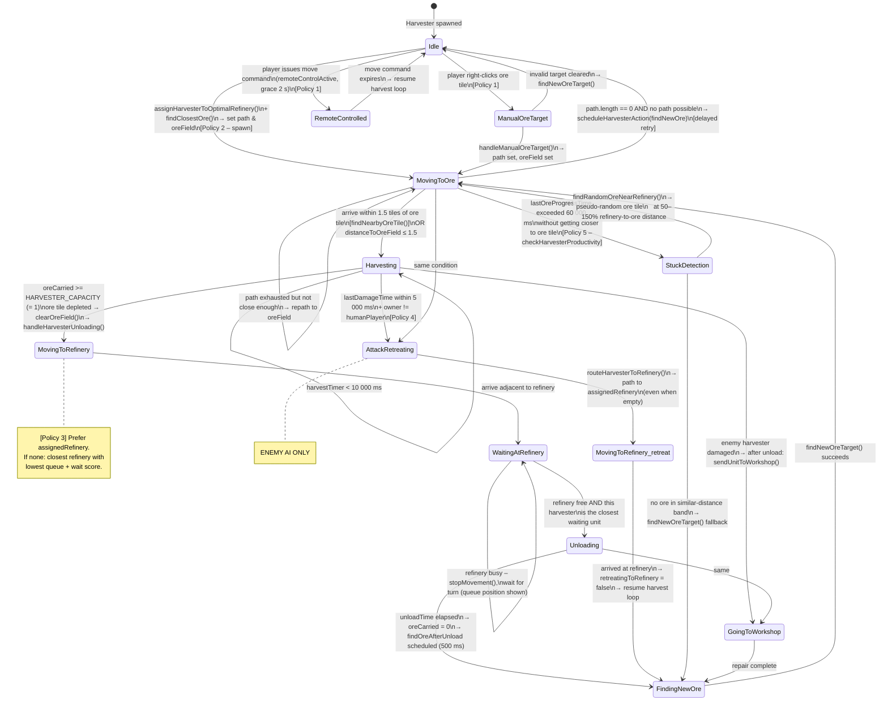

# Harvester Automated Behaviour Policies

This document describes all automated harvester behaviour for both **player** and **enemy AI** units.
Policies are ordered from **highest priority** (1) to **lowest** (5).

---

## Priority Overview

| Priority | Policy | Applies To |
|---|---|---|
| 1 | Go where the player sent you; idle on non-ore tiles | Player only (+ enemy follows equivalent logic) |
| 2 | On factory spawn → auto-go to nearest ore field | Both |
| 3 | Always prefer the player-assigned refinery for unloading | Both |
| 4 | If attacked → retreat to refinery immediately, then resume | **Enemy AI only** |
| 5 | If unproductive for 60 s → reassign to pseudo-random ore at similar distance | Both |

---

## Mermaid State Diagram

---

## Policy Details

### Policy 1 – Player Command Override (highest priority)

- When a player **right-clicks an ore tile**, `unit.manualOreTarget` is set.
  `handleManualOreTarget()` paths the harvester there and clears the field automatically
  after one harvest cycle.
- When the player issues any **move command** (`remoteControlActive = true`, or within the
  2 s grace window after the last command), automated harvesting decisions are suspended.
- If the player sends the harvester to a **non-ore tile**, it stays idle at that location
  until the player sends it to an ore tile (manual override persists).

### Policy 2 – Auto-harvest on Spawn

When a harvester is produced from a Vehicle Factory **without a custom rally point**:
1. `assignHarvesterToOptimalRefinery()` distributes it to the least-loaded refinery.
2. `findClosestOre()` finds the nearest free ore tile.
3. A path is calculated and `oreField` / `path` / `moveTarget` are set immediately.

### Policy 3 – Prefer Assigned Refinery

`handleHarvesterUnloading()` follows this priority when choosing a refinery:
1. **Manual assignment** via `unit.assignedRefinery` (e.g. from a force-unload command).
2. **Current target refinery** `unit.targetRefinery` if still valid (stability: no thrashing).
3. **Closest refinery** with lowest combined distance + queue score (new assignment).

The assignment is stored in `unit.assignedRefinery` and reused for subsequent cycles.

### Policy 4 – Enemy Harvester Attack Retreat *(enemy AI only)*

Triggered inside `updateHarvesterLogic` when:
- `unit.owner !== humanPlayer`
- `unit.lastDamageTime` was set within the last **5 000 ms** (`HARVESTER_ATTACK_RETREAT_MS`)

On trigger:
1. Any active harvesting is aborted; `harvestedTiles` entry is released.
2. `oreField` is cleared; movement is stopped.
3. `unit.retreatingToRefinery = true` is set.
4. `routeHarvesterToRefinery()` paths the unit to its assigned (or nearest) refinery –
   **even if it carries no ore**.
5. On arrival at the refinery, `retreatingToRefinery` is cleared and the normal harvest
   loop resumes (with `findOreAfterUnload` already scheduled).

### Policy 5 – 60-second Stuck / Unproductive Reassignment

Tracked inside `checkHarvesterProductivity()` which runs every **500 ms**:

- `unit.lastOreProgressTime` records when the harvester last got meaningfully closer
  to its ore target (closer by ≥ 0.5 tiles).
- If **60 seconds** pass (`HARVESTER_ORE_STUCK_TIMEOUT_MS`) without progress while
  `oreField` is set and the unit is neither harvesting nor unloading:
  1. `findRandomOreNearRefinery()` is called.
  2. All available ore tiles at **50–150% of the current ore tile's distance from the
     assigned refinery** are gathered.
  3. A **pseudo-random** tile is selected (seeded by `unit.id` sum for determinism).
  4. If no tiles exist in that band, `findNewOreTarget()` is used as a fallback.

---

## Key Constants

| Constant | Value | Purpose |
|---|---|---|
| `HARVEST_DISTANCE_TOLERANCE` | `1.5` tiles | Matches `MOVE_TARGET_REACHED_THRESHOLD`; harvesters start harvesting when within 1.5 tiles of ore centre |
| `HARVESTER_ATTACK_RETREAT_MS` | `5 000 ms` | Grace window after last damage that keeps enemy harvester in retreat mode |
| `HARVESTER_ORE_STUCK_TIMEOUT_MS` | `60 000 ms` | Maximum unproductive time before forced ore reassignment (Policy 5) |
| `HARVESTER_PRODUCTIVITY_CHECK_INTERVAL` | `500 ms` | How often `checkHarvesterProductivity()` runs |
| `HARVESTER_CAPPACITY` | `1` | Ore units a harvester can carry (triggers unload as soon as one unit is mined) |
| `HARVESTER_REMOTE_OVERRIDE_GRACE_MS` | `2 000 ms` | Grace period after a player move command before auto-harvest resumes |
