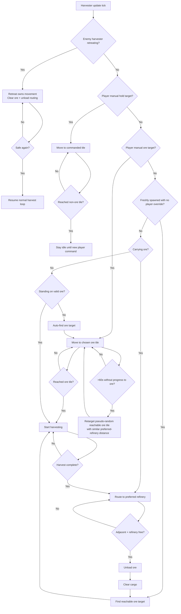

# Havester Policies

This document describes the full automated harvester policy after the 2026-03-31 audit and fix pass.

## Priority Order

1. Player-issued command ownership
2. Spawn/default automation
3. Preferred assigned refinery
4. Enemy-only retreat on attack
5. Long-term stagnation recovery

## Mermaid Overview

## Policy Details

- Player move to non-ore: interrupts active harvesting/unloading, travels to the requested tile, then holds position there.
- Player move to ore: interrupts active harvesting/unloading, travels to the requested ore tile, then starts normal automated harvesting and refinery unloading.
- Spawn behavior: new harvesters without a player override acquire a reachable ore target automatically.
- Preferred refinery: unload and stuck-unload recovery always prefer the harvester's assigned refinery when one exists.
- Enemy attack response: only enemy AI harvesters use the retreat branch; during retreat, economy routing is paused so movement ownership is not contested. AI retreats use path-based forward movement (not the player backward-movement retreat system). The post-retreat cooldown is always respected, even when threats are still visible.
- Long-term recovery: a route is only considered productive if the harvester is actually harvesting, unloading, or reducing distance to its goal. Mere possession of a path or move target does not count.
- Recovery target selection: reroutes choose a pseudo-random reachable ore tile from the best similarity shortlist so repeated loops do not keep picking the same trapped geometry.

## Root Causes Fixed

- The player tactical retreat system (`updateRetreatBehavior` in retreat.js) was running for AI harvester retreats. Its straight-line path-block check hit buildings near the retreat target, clearing `isRetreating` immediately and creating an infinite cancel-re-trigger loop.
- `shouldHarvesterSeekProtection` checked nearby threats before the post-retreat cooldown, so the 4-second cooldown was bypassed when threats were visible, causing immediate re-retreat.
- Manual ore targets could reach the ore tile and still sit idle because manual priority suppressed auto-harvest while the manual-target handler did not start harvesting on arrival.
- Normal player move commands did not establish a persistent non-ore hold state, so automation could take the harvester back over after the move completed.
- Productivity checks treated `path`/`moveTarget` as sufficient evidence of progress, which allowed blocked or looping harvesters to look “busy” forever.
- Stuck unload recovery could switch away from an assigned refinery, violating the intended refinery preference.
